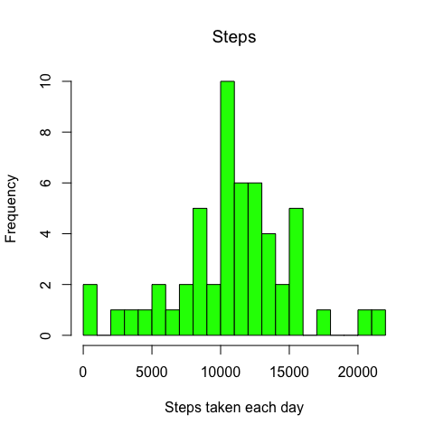
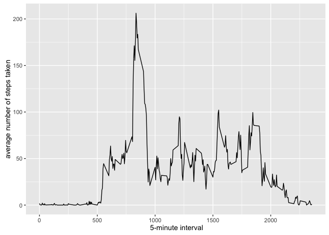
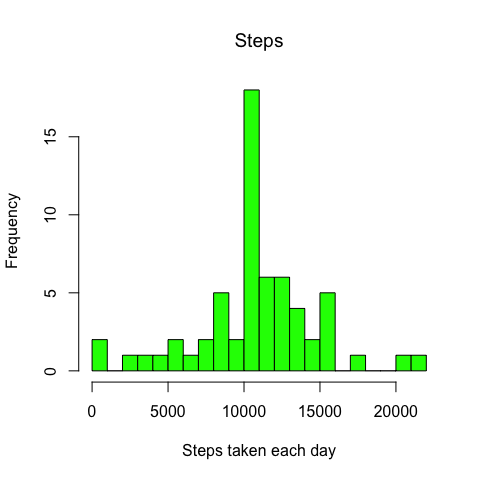

# Reproducible Research: Peer Assessment 1


##1 Loading and preprocessing the data

```r
setwd("/Users/cjmarchante/gitrepos/RepData_PeerAssessment1")
activity <- read.csv("activity.csv", header = T)

# create a subset with NA removed
activity_nona <- subset(activity, is.na(activity$steps) == F)
```


##2 What is mean total number of steps taken per day?

### Calculate the total number of steps taken per day


```r
library(plyr)
stepsbyday <- ddply(activity_nona, .(date), summarise, stepsbyday=sum(steps))
```

### Histogram of the total number of steps taken each day


```r
hist(as.numeric(stepsbyday$steps), breaks = 20, main="Steps", 
     xlab="Steps taken each day", ylab = "Frequency", col="green")
```

<!-- -->

### Calculate and report the mean and median of the total number of steps taken per day

mean

```r
mean(stepsbyday$steps)
```

```
## [1] 10766.19
```

median

```r
median(stepsbyday$steps)
```

```
## [1] 10765
```


##3 What is the average daily activity pattern?

Calculating the average by interval

```r
meanstepsbyday<-ddply(activity_nona, .(interval), summarise,meanday=mean(steps))
```

Plot

```r
library(ggplot2)
qplot(interval,meanday, data=meanstepsbyday,geom ="line",xlab=" 5-minute interval",ylab="average number of steps taken" )
```

<!-- -->

Which 5-minute interval, on average across all the days in the dataset, contains the maximum number of steps?

```r
meanstepsbyday[which.max(meanstepsbyday$meanday),]
```

```
##     interval  meanday
## 104      835 206.1698
```
Interval from 8:35 to 8:40

##4 Imputing missing values

Calculate and report the total number of missing values in the dataset (i.e. the total number of rows with 𝙽𝙰s)


```r
sum(is.na(activity$steps))
```

```
## [1] 2304
```

Devise a strategy for filling in all of the missing values in the dataset: **I will use the mean of the day for the N/A interval**

Create a new dataset that is equal to the original dataset but with the missing data filled in.

```r
newactivity<- activity


for (i in 1:nrow(newactivity)){if (is.na(newactivity$steps[i])){newactivity$steps[i] <- meanstepsbyday$meanday[which(newactivity$interval[i] == meanstepsbyday$interval)]}
}


newactivity <- arrange(newactivity, interval)
```


Make a histogram of the total number of steps taken each day and Calculate and report the mean and median total number of steps taken per day. Do these values differ from the estimates from the first part of the assignment?

Calculating the average by date

```r
newstepsbyday <- ddply(newactivity, .(date), summarise, stepsbyday=sum(steps))
```


```r
hist(as.numeric(newstepsbyday$steps), breaks = 20, main="Steps", xlab="Steps taken each day", ylab = "Frequency", col="green")
```

<!-- -->


mean

```r
mean(newstepsbyday$steps)
```

```
## [1] 10766.19
```

median

```r
median(newstepsbyday$steps)
```

```
## [1] 10766.19
```

What is the impact of imputing missing data on the estimates of the total daily number of steps?


```r
mean(newstepsbyday$steps)-mean(stepsbyday$steps)
```

```
## [1] 0
```

```r
median(newstepsbyday$steps)-median(stepsbyday$steps)
```

```
## [1] 1.188679
```

So the frequency is higher around the median.

##5 Are there differences in activity patterns between weekdays and weekends?

###Create a new factor variable in the dataset with two levels – “weekday” and “weekend” indicating whether a given date is a weekday or weekend day

```r
newactivity$weekdays <- weekdays(as.Date(newactivity$date))
newactivity$weekdays <- ifelse(newactivity$weekdays %in% c("sábado", "domingo"),"weekend", "weekday") #changing days of week in spanish, cannot change to English in my mac
```

###Make a panel plot containing a time series plot (i.e. 𝚝𝚢𝚙𝚎 = "𝚕") of the 5-minute interval (x-axis) and the average number of steps taken, averaged across all weekday days or weekend days (y-axis)
average for each interval

```r
average <- ddply(newactivity, .(interval, weekdays), summarise, steps=mean(steps))
```

plot


```r
library(lattice)
xyplot(steps ~ interval | weekdays, data = average, layout = c(1, 2), type="l", xlab = "Interval", ylab = "Number of steps")
```

<!-- -->
